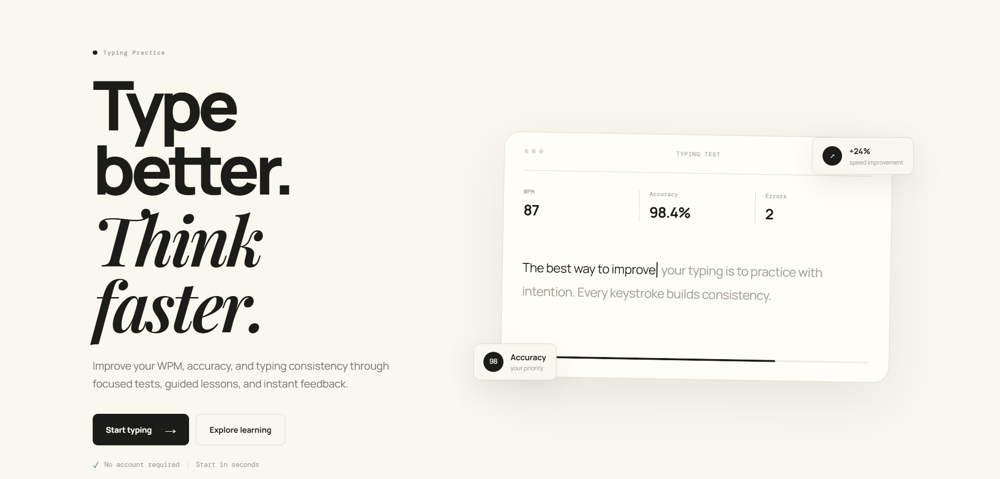
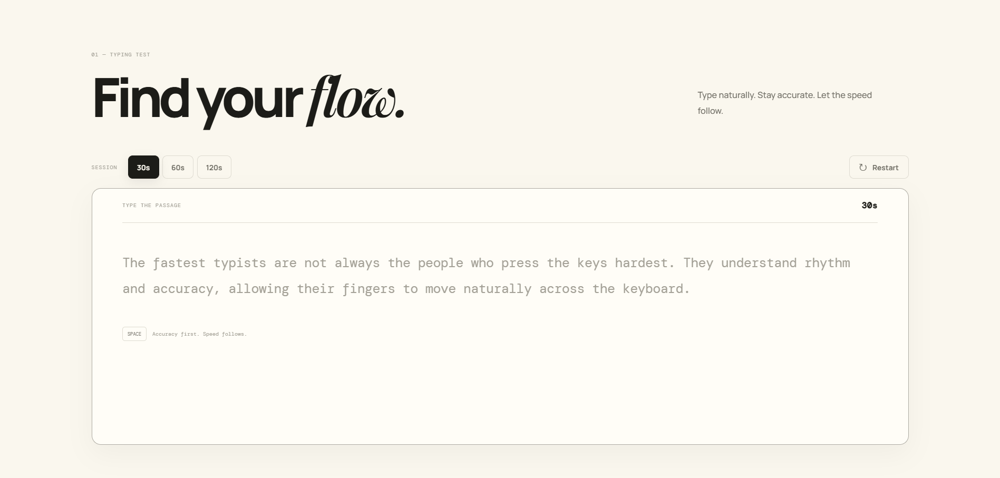
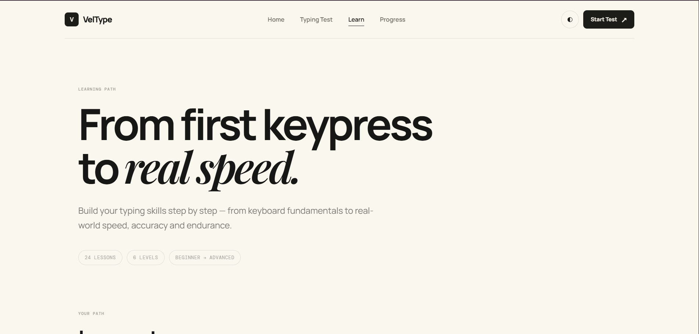
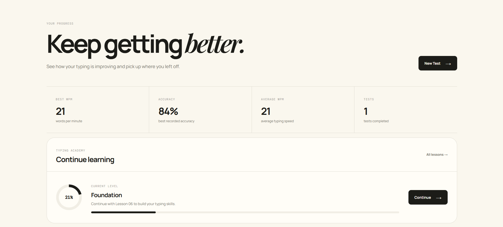

# VelType

> **Flow Into Speed.**  
> A modern typing practice and learning platform built to help users improve speed, accuracy, consistency, and touch-typing technique.

[](https://your-username.github.io/veltype/)
[](https://developer.mozilla.org/en-US/docs/Web/HTML)
[](https://developer.mozilla.org/en-US/docs/Web/CSS)
[](https://developer.mozilla.org/en-US/docs/Web/JavaScript)
[](#responsive-design)

---

## Overview

**VelType** is a responsive, browser-based typing testing and learning website designed around one simple idea:

**typing faster should never mean typing carelessly.**

The platform combines timed typing tests with a structured learning path and a personal progress dashboard. Users can practice without creating an account, while their results and lesson progress are stored locally in the browser.

The project focuses on:

- Clean, premium visual design
- Real-time typing feedback
- Speed and accuracy measurement
- Structured touch-typing lessons
- Persistent browser-based progress
- Responsive mobile and desktop experiences
- Accessible and semantic HTML
- Modular vanilla JavaScript

---

## ✨ Features

### ⌨️ Typing Test

- Timed typing sessions
- Multiple test durations
- Randomized practice passages
- Real-time character validation
- Correct characters highlighted immediately
- Incorrect characters highlighted immediately
- Live timer with warning states
- Automatic completion when the passage ends
- WPM calculation
- Raw WPM calculation
- Accuracy calculation
- Error count
- Character count
- Test history stored locally
- Restart test functionality

### 🎓 Typing Academy

VelType includes a structured **24-lesson learning path** divided into six progressive levels:

| Level | Focus | Lessons |
|---|---|---:|
| Foundation | Touch-typing fundamentals | 01–04 |
| Core Typing | Full-keyboard control | 05–08 |
| Accuracy | Reliable typing technique | 09–14 |
| Speed | Increasing speed with control | 15–18 |
| Real World | Practical computer typing | 19–22 |
| Advanced | Speed, endurance & consistency | 23–24 |

Lessons are progressively unlocked, so users build their skills in sequence instead of jumping randomly through the curriculum.

### 📊 Progress Dashboard

The dashboard connects directly to the data generated by the typing test and learning system.

It provides:

- Best WPM
- Best recorded accuracy
- Completed typing tests
- Completed lessons
- Overall academy progress
- Current learning level
- Current lesson
- Lesson completion percentage
- Typing test history
- Progress reset controls
- Exercise reset controls

### 💾 Local Storage

VelType works without an account or backend database.

Browser `localStorage` is used to persist:

- Typing test history
- Lesson completion
- Lesson progress
- Exercise progress
- Overall user progress

This makes the project lightweight and deployable as a static website.

### 📱 Responsive Design

Designed to work across:

- Mobile phones
- Tablets
- Laptops
- Desktop displays

The interface adapts navigation, cards, typing areas, lesson lists, and dashboard content for smaller screens.

---

## 🎨 Design Direction

VelType follows a minimal, editorial-inspired interface rather than a typical gaming-style typing website.

### Design principles

- **Clarity over decoration**
- **Typography-first hierarchy**
- **Low visual noise**
- **Strong spacing system**
- **Subtle borders and surfaces**
- **Focused interaction states**
- **Premium neutral palette**
- **Responsive layouts**
- **Consistent component styling**

The visual language combines:

- Manrope for interface typography
- DM Mono for technical/statistical labels
- Playfair Display for editorial emphasis
- Warm off-white surfaces
- Deep ink tones
- Minimal accent usage
- Soft cards and borders

---

## 🖼️ Project Visuals

A strong GitHub README should show the project visually instead of relying only on text.

Recommended showcase order:

### Homepage

Place the main homepage screenshot here:

```text
assets/
└── screenshots/
    ├── homepage.png
    ├── typing-test.png
    ├── learning.png
    └── dashboard.png
```

Then add:

```md

```

### Typing Test

```md

```

### Learning Academy

```md

```

### Progress Dashboard

```md

```

> **Tip:** The homepage image should be the first major screenshot because it gives recruiters an immediate understanding of the project's visual quality.

---

## 🧠 How It Works

### Typing Test Flow

```text
User opens Typing Test
        ↓
Random passage is generated
        ↓
User starts typing
        ↓
Timer starts automatically
        ↓
Characters are validated in real time
        ↓
Correct / incorrect characters are tracked
        ↓
Test finishes when time expires or passage ends
        ↓
WPM + accuracy + errors are calculated
        ↓
Result is saved to localStorage
        ↓
Dashboard reads the saved test data
```

### Learning Flow

```text
Lesson 01
   ↓
Complete lesson
   ↓
Lesson 02 unlocks
   ↓
Continue through the learning path
   ↓
Completion is stored locally
   ↓
Dashboard calculates academy progress
```

---

## 🗃️ Data Architecture

VelType uses browser storage rather than a traditional backend.

### Typing test data

Stored under:

```text
veltypeTests
```

Each test result contains information such as:

```js
{
    wpm: 52,
    rawWpm: 57,
    accuracy: 96,
    errors: 3,
    characters: 285,
    correctCharacters: 274,
    duration: 30,
    mode: 30,
    date: "...",
    timestamp: 1234567890
}
```

### Lesson progress

Stored under:

```text
veltypeLessonProgress
```

Lesson records track completion and progress for the learning academy.

The dashboard reads the stored data and derives:

- Best performance
- Test count
- Lesson completion
- Academy percentage
- Current lesson
- Current level
- Recent test history

This keeps the UI and stored data separated from the presentation layer.

---

## 📁 Project Structure

```text
VelType/
│
├── index.html
├── test.html
├── learn.html
├── lesson.html
├── dashboard.html
│
├── css/
│   ├── style.css
│   ├── test.css
│   ├── learn.css
│   ├── lesson.css
│   └── dashboard.css
│
├── js/
│   ├── main.js
│   ├── typing.js
│   ├── learn.js
│   ├── lesson.js
│   ├── lessondata.js
│   └── dashboard.js
│
├── assets/
│   ├── images/
│   └── screenshots/
│
└── README.md
```

---

## 🛠️ Tech Stack

### Frontend

- **HTML5** — semantic page structure
- **CSS3** — responsive layouts, animations, transitions, and visual system
- **Vanilla JavaScript** — application logic and interactions
- **Web Storage API** — persistent client-side data
- **Google Fonts** — Manrope, DM Mono, Playfair Display

### Why Vanilla JavaScript?

VelType intentionally avoids a framework to demonstrate strong understanding of core frontend development:

- DOM manipulation
- Event handling
- State management
- Local storage
- URL/query parameter handling
- Dynamic rendering
- Input validation
- Responsive interaction
- Component-like JavaScript organization

---

## 🚀 Getting Started

### 1. Clone the repository

```bash
git clone https://github.com/your-username/veltype.git
```

### 2. Open the project

Open the project folder in VS Code or another editor.

### 3. Run locally

Because VelType is a static frontend project, it can be opened directly in a browser.

For the best development experience, use **VS Code Live Server** or any static HTTP server.

### 4. Start practicing

Open:

```text
index.html
```

and navigate to:

```text
Typing Test
Learn
Progress
```

---

## 🌐 Deployment

VelType is suitable for static hosting because it does not require a server-side runtime.

It can be deployed using:

- GitHub Pages
- Vercel
- Netlify
- Any static web host

For GitHub Pages:

```text
Repository
   ↓
Settings
   ↓
Pages
   ↓
Deploy from branch
   ↓
Select main branch
   ↓
/root
   ↓
Save
```

---

## 🔐 Privacy

VelType does not require user registration.

Typing results and learning progress are stored in the user's browser using `localStorage`.

No personal typing history needs to be uploaded to a server.

Clearing browser storage or using the dashboard's reset controls can remove saved progress.

---

## ♿ Accessibility Considerations

The project uses several accessibility-oriented practices:

- Semantic HTML elements
- Button elements for interactive controls
- Navigation labels
- ARIA attributes for expandable learning levels
- Keyboard-focused interactions
- Visible focus/interaction states
- `aria-hidden` for decorative interface elements
- Responsive text and controls

Accessibility remains an area for continued improvement as the project evolves.

---

## 📈 Future Improvements

Potential future versions could add:

- User accounts and cloud synchronization
- Backend-based statistics
- Global typing leaderboard
- More typing passages
- Custom test passages
- Typing heatmaps
- Daily typing challenges
- Streak tracking
- Detailed performance charts
- Personal typing analytics
- More advanced lesson exercises
- Keyboard-layout support
- Exportable progress reports
- PWA/offline support
- Accessibility audit and WCAG refinement

---

## 🧪 Project Highlights

This project demonstrates practical frontend development beyond a static landing page.

### JavaScript

The application handles:

- Real-time typing state
- Timers
- WPM calculations
- Accuracy calculations
- Dynamic passage rendering
- Lesson progression
- Unlock logic
- Local data persistence
- Dashboard data aggregation
- Modal interactions
- Responsive navigation interactions

### CSS

The interface demonstrates:

- Responsive layouts
- CSS custom properties
- Grid and Flexbox
- Transitions
- Micro-interactions
- Progress indicators
- Animated counters
- Expandable lesson sections
- Responsive navigation
- Mobile-first considerations

### Product Thinking

VelType is structured as a complete user journey:

```text
Discover
   ↓
Start Test
   ↓
Practice
   ↓
Learn
   ↓
Improve
   ↓
Track Progress
   ↓
Repeat
```

The goal is not simply to display a typing test, but to create a small, coherent learning product.

---

## 💼 Why This Project Matters

VelType was built to demonstrate the ability to take a product from **idea → interface → interaction → data → deployment**.

Instead of creating only a visually attractive homepage, the project includes a connected experience where:

- The typing test generates real performance data.
- The data persists between sessions.
- The dashboard reads and calculates that data.
- The learning academy tracks lesson completion.
- Lessons unlock progressively.
- The dashboard reflects learning progress.
- The entire experience works without requiring a backend.

This makes VelType a practical demonstration of frontend engineering, UI/UX implementation, JavaScript logic, browser APIs, and product thinking.

---

## 👨‍💻 Author

**Ritvik Jadhav**

BSc IT Student | Frontend Developer

Interested in:

- Web Development
- UI/UX
- JavaScript
- Python
- Java
- Databases
- AI-powered applications

---

## 📄 License

This project is available for learning, portfolio, and demonstration purposes.

If you reuse substantial portions of the project, please provide appropriate attribution.

---

## ⭐ If You Like VelType

If you find the project useful or interesting, consider giving the repository a ⭐ on GitHub.

---

<p align="center">
  <strong>VelType</strong><br>
  <em>Flow Into Speed.</em>
</p>
